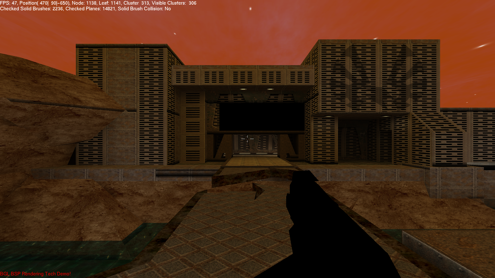

# BGL Shooter Tech Demo



A modernized, high-performance **C++23** Quake II BSP and MD2 rendering engine tech demo targeting modern 64-bit Linux.

> [!NOTE]
> **Historical Retro Codebase (~20 Years Old):**  
> Originally developed around 2004–2006 for Windows, this project is a historical 3D first-person tech demo powered by the **legacy OpenGL 1.x/2.x fixed-function pipeline** (`glBegin`/`glEnd`, `glMatrixMode`, fixed-function lightmap blending with `GL_MODULATE`, display lists, and classic texture environment stages).  
> 
> The codebase has been fully modernized to build with **C++23**, **GLM**, **spdlog**, **RAII memory management**, **Conan v2**, and **CMake**, running natively on modern Linux desktops while preserving its authentic early 2000s graphics rendering pipeline and retro aesthetics.

---

## 🚀 Key Features & Modernization Architecture

* **Retro OpenGL 1.x/2.x Graphics Engine:** Preserves original Quake II BSP map rendering, multi-textured lightmap passes (`GL_TEXTURE0` / `GL_TEXTURE1`), animated MD2 3D models with vertex interpolation, and PVS (Potentially Visible Set) cluster culling using classic fixed-function mechanics.
* **C++23 Modern Standard:** Upgraded to the modern C++23 ISO standard with strict RAII containers (`std::vector`, `std::unique_ptr`), Rule-of-Five resource management for OpenAL audio, and zero raw dynamic allocations/memory leaks.
* **spdlog Console Logging:** Integrated `spdlog` for clean, timestamped structured console logging and diagnostics across all engine subsystems.
* **GLM Math Integration:** Migrated legacy 3D vector and matrix calculations to modern `glm::vec3` and GLM extension utilities.
* **Conan v2 & CMake Build Pipeline:** Automated dependency management (`FreeGLUT`, `GLEW`, `DevIL`, `FreeALUT`, `OpenAL`, `GLM`, `spdlog`) via Conan 2.x and CMake 3.20+.
* **Linux Desktop Compatibility:** Replaced legacy Windows API calls (`windows.h`, `timeGetTime`) with portable standard C++ library primitives, FreeGLUT windowing, and X11/Wayland support.

---

## 🛠️ System Requirements

* **Operating System:** Linux (Ubuntu 22.04+ / Debian 12+ x86_64)
* **Compiler:** GCC 13+ or Clang 16+ (with full C++23 support)
* **Build Tools:** CMake 3.20+, Conan 2.x, `go-task` (`task`), `clang-format`
* **Graphics & Audio Drivers:** OpenGL-compatible graphics driver, OpenAL / ALSA audio backend

---

## ⚙️ Building and Running

### 1. Install Dependencies (Conan v2)

```bash
task setup
```

### 2. Configure Project

```bash
task configure
```

### 3. Build Executable

```bash
task build
```

### 4. Run Technical Demo

```bash
task run
```

### Utility Commands

* **Format Code:** `task format`
* **Clean Build Tree:** `task clean`

---

## 🎮 Configuration Settings

Engine configuration settings are managed in English within `bin/configuration.ini`:

| Setting | Default Value | Description |
| :--- | :--- | :--- |
| `Windowed` | `0` | `0` for Fullscreen mode (Full HD), `1` for Windowed mode. |
| `ResolutionX` | `1920` | Screen width in pixels (`-1` selects desktop default). |
| `ResolutionY` | `1080` | Screen height in pixels (`-1` selects desktop default). |
| `PositionX`, `Y`, `Z` | `500, 500, 500` | Initial 3D player spawn position in map space. |
| `RotationX`, `Y`, `Z` | `0, 0, 0` | Initial player camera viewing orientation. |
| `Audio` | `1` | Enable (`1`) or disable (`0`) OpenAL ambient sound effects and music. |
| `Skybox` | `1` | Enable (`1`) or disable (`0`) 3D skybox rendering. |
| `AnimateWater` | `1` | Enable (`1`) or disable (`0`) animated water surface textures. |

---

## 📜 License

This project is released under the **MIT License**. See the `LICENSE` file for full terms.
