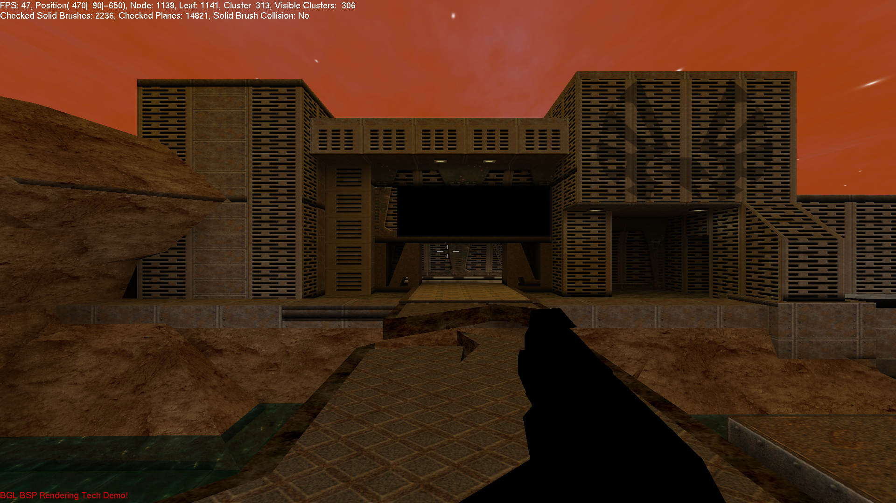

⚠️ This is very old and bad code from my school days. ⚠️

# Features
- multi texturing
- light maps
- collision detection
- view frustum culling
- (Quake2) BSPs

# Controls

## Keyboard
|   |   |
|---|---|
ESC   | exit
WASD  | move around 

## Mouse
|   |   |
|---|---|
left/right     | rotate left/right
scroll up/down | hower up/down
left mouse key | shoot